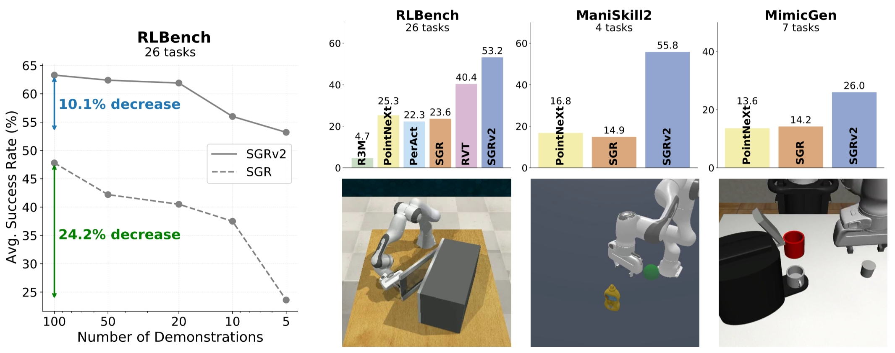
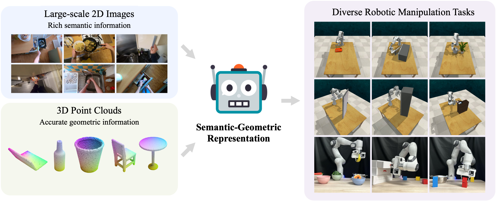

# SGRv2 & SGR

This is the official repository for [SGRv2](https://sgrv2-robot.github.io/) and [SGR](https://semantic-geometric-representation.github.io/).

### SGRv2
[**Leveraging Locality to Boost Sample Efficiency in Robotic Manipulation**](https://sgrv2-robot.github.io/)  
[Tong Zhang](https://tongzhangthu.github.io/), [Yingdong Hu](https://yingdong-hu.github.io/), Jiacheng You, [Yang Gao](https://yang-gao.weebly.com/)<br/>
***arXiv, 2024***



<b>Left:</b> Sample efficiency of SGRv2. <b>Top Right:</b> Overview of simulation results. <b>Bottom Right:</b> Tasks of the 3 simulation benchmarks.

### SGR
[**A Universal Semantic-Geometric Representation for Robotic Manipulation**](https://semantic-geometric-representation.github.io/)  
[Tong Zhang](https://tongzhangthu.github.io/), [Yingdong Hu](https://yingdong-hu.github.io/), Hanchen Cui, [Hang Zhao](https://hangzhaomit.github.io/), [Yang Gao](https://yang-gao.weebly.com/)<br/>
[***CoRL, 2023***](https://www.robot-learning.org/) 



Leveraging semantic information from massive 2D images and geometric information from 3D point clouds, we present <b>Semantic-Geometric Representation (SGR)</b> that enables the robots to solve a range of simulated and real-world manipulation tasks.


## Keyframe Control on RLBench

### Install
- Tested (Recommended) Versions: Python 3.8. We used CUDA 11.1. 

- **Step 1:** We recommend using [conda](https://docs.conda.io/en/latest/miniconda.html) and creating a virtual environment.
```
conda create --name sgr python=3.8
conda activate sgr
```

- **Step 2:** Install PyTorch. Make sure the PyTorch version is compatible with the CUDA version. One recommended version compatible with CUDA 11.1 can be installed with the following command. More instructions to install PyTorch can be found [here](https://pytorch.org/).
```
conda install pytorch==1.12.1 torchvision==0.13.1 torchaudio==0.12.1 cudatoolkit=11.3 -c pytorch
```

- **Step 3:** Install CoppeliaSim. PyRep requires version **4.1** of CoppeliaSim. Download and unzip CoppeliaSim: 
- [Ubuntu 16.04](https://www.coppeliarobotics.com/files/CoppeliaSim_Edu_V4_1_0_Ubuntu16_04.tar.xz)
- [Ubuntu 18.04](https://www.coppeliarobotics.com/files/CoppeliaSim_Edu_V4_1_0_Ubuntu18_04.tar.xz)
- [Ubuntu 20.04](https://www.coppeliarobotics.com/files/CoppeliaSim_Edu_V4_1_0_Ubuntu20_04.tar.xz)

Once you have downloaded CoppeliaSim, add the following to your *~/.bashrc* file. (__NOTE__: the 'EDIT ME' in the first line)

```
export COPPELIASIM_ROOT=<EDIT ME>/PATH/TO/COPPELIASIM/INSTALL/DIR
export LD_LIBRARY_PATH=$LD_LIBRARY_PATH:$COPPELIASIM_ROOT
export QT_QPA_PLATFORM_PLUGIN_PATH=$COPPELIASIM_ROOT
```
Remember to source your .bashrc (`source ~/.bashrc`) or  .zshrc (`source ~/.zshrc`) after this.

- **Step 4:** Install PyRep.
Once you have install CoppeliaSim, you can pull PyRep from git:
```
cd <install_dir>
git clone https://github.com/stepjam/PyRep.git
cd PyRep
```
Then install the python library:
```
pip install -r requirements.txt
pip install .
```

- **Step 5:** Clone the SGR repository with the submodules using the following command.

```
cd <install_dir>
git clone --recurse-submodules git@github.com:TongZhangTHU/sgr.git 
cd sgr 
git submodule update --init
```

Now, locally install [my RLBench fork](https://github.com/TongZhangTHU/RLBench/tree/sgr), [my YARR fork](https://github.com/TongZhangTHU/YARR/tree/sgr), [my openpoints fork](https://github.com/TongZhangTHU/openpoints/tree/sgr), and other libraries using the following command. Make sure you are in folder `sgr`.
```
pip install -r libs/RLBench/requirements.txt
pip install -e libs/RLBench 
pip install -r libs/YARR/requirements.txt
pip install -e libs/YARR 
pip install git+https://github.com/openai/CLIP.git
pip install -r requirements.txt
```

For running RLBench/CoppeliaSim in **headless mode**, please refer to [here](https://forum.coppeliarobotics.com/viewtopic.php?t=9294).
 
- **Step 6:** Install the C++ extensions, the PointNet++ library. These are used to speed up the farthest point sampling (FPS).
```
cd openpoints/cpp/pointnet2_batch
pip install .
cd ../../../
```


### Data Generation
We utilize the tools in `libs/RLBench/tools/dataset_generator.py` to generate data. There are two differences between the data used in our paper and that used in PerAct's paper: (1) We employ OpenGL3 for rendering, which supports additional features such as shadows, unlike the data in PerAct's paper which uses OpenGL. (2) In SGRv2, since each task utilizes only 5 demonstrations, we use the first variation for tasks with multiple variations, in contrast to PerAct, which combines all variations.

Below is an example of how to generate data. For more details, see `scripts/gen_data.sh`. These commands can be executed in parallel for multiple tasks.
```
python libs/RLBench/tools/dataset_generator.py \
                          --save_path=data/train \
                          --tasks=open_microwave \
                          --image_size=128,128 \
                          --renderer=opengl3 \
                          --episodes_per_task=100 \
                          --variations=1 \
                          --all_variations=False
```

### Training and Evaluatation
The following is a guide for training everything from scratch. All tasks follow a 4-phase workflow:

1. Generate `train` and `test` datasets using `libs/RLBench/tools/dataset_generator.py`.
2. Train SGRv2 or SGR using `train.py` with 5 demonstrations per task for 20,000 iterations, saving checkpoints every 800 iterations. If training with more demonstrations, it is recommended to increase the number of iterations accordingly.
3. Run evaluation using `eval.py` with `framework.eval_type=missing5` and `framework.eval_episodes=50` to assess the last 5 checkpoints across 50 episodes on `test` data, and save the results in `eval_data.csv`.
4. Repeat steps 2 and 3 with 3 seeds and report the average results.

The scripts for training and evaluating SGRv2 and SGR can be found in `scripts/run_sgrv2.sh` and `scripts/run_sgrv1.sh`, respectively. It is recommended to run multiple seeds to reduce variance.


## TODO
- [ ] Scripts for baseline models, including PerAct, PointNeXt, and R3M.
- [ ] Scripts for ablation studies.
- [ ] The implementation of dense control.


## Acknowledgement
We sincerely thank the authors of the following repositories for sharing their code.
- [PerAct](https://github.com/peract/peract)
- [PyRep](https://github.com/stepjam/PyRep)
- [RLBench](https://github.com/stepjam/RLBench/tree/master)
- [YARR](https://github.com/stepjam/YARR)
- [RVT](https://github.com/NVlabs/RVT)

## Citation
If you find our work useful, please consider citing:

```
@article{zhang2024leveraging,
    title={Leveraging Locality to Boost Sample Efficiency in Robotic Manipulation},
    author={Zhang, Tong and Hu, Yingdong and You, Jiacheng and Gao, Yang},
    journal={arXiv preprint arXiv:2406.10615},
    year={2024}
  }
```
```
@article{zhang2023universal,
    title={A Universal Semantic-Geometric Representation for Robotic Manipulation},
    author={Zhang, Tong and Hu, Yingdong and Cui, Hanchen and Zhao, Hang and Gao, Yang},
    journal={arXiv preprint arXiv:2306.10474},
    year={2023}
  }
```